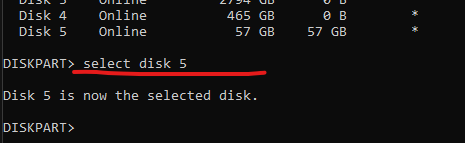

# Using Diskpart to format drives to specific filesystems

**Open Diskpart**
    
    - In windows search for CMD and right click run as ADMIN


    
    - Once open; type "diskpart" (no quotes) and then hit enter
      - This will initialize the program
      - Everything will be done in the command line from now on


    - Next type "list disk"
      - This will list all disks in the system


    - Next type "select disk #" 
    - # being the disk number according to the listing
    - In this case I am formatting a 64 gb usb so I would select Disk 5



    - Next type "list partion"
      - This will list all partions on the drive
      - We will want to select the Primary Partition (In this case partition 2)
      - We can think of partions as rooms in a house
        - You can seperate the drive into different sectors for organization.
        - For this excercise we will only be creating 1 partion but do keep in mind we can create more than one on the same physical drive


    - Next select partition 2 by typing:
      - select partition 2
    - You will see it becomes the selected partition


    - Finally we will format the drive
      - We will format it to exFAT however we could format to many different formats here including FAT32, exFAT, NTFS, etc...
      - The reason why exFAT is used on the media equipment is most likely due to the fact that is running some version of an operating system based on unix or linux. In order to be able to transfer files efficiently between windows, mac and linux we must use this file system.


    - A break down of the format is as follows:

```CMD
format fs=exfat

REM: format (This is the command)
REM: fs= (We now define the argument for the file system)
REM: and then we set the file system equal to exfat (fs=exfat)
```

    - Once it says completed we can eject the drive and put it in the camera switcher.